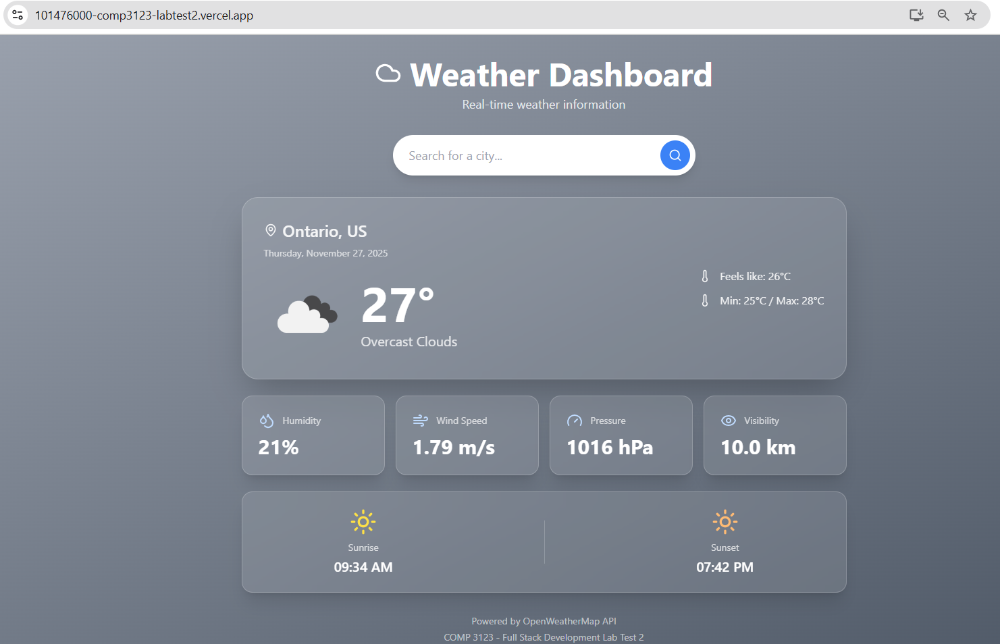
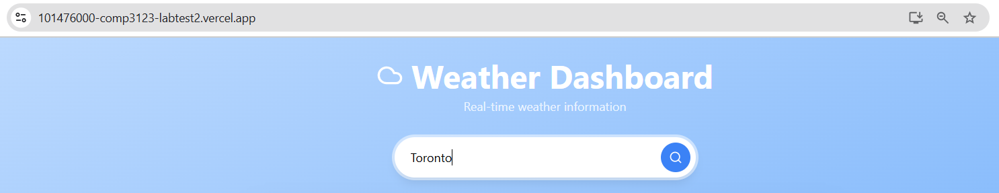
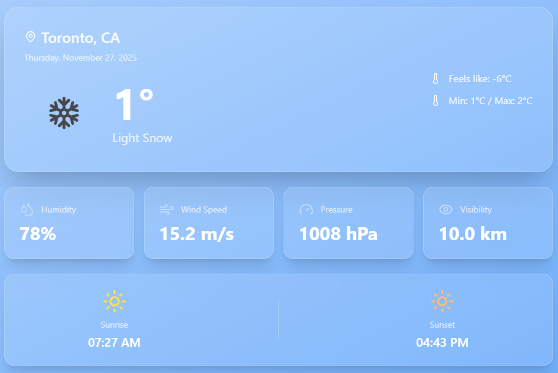
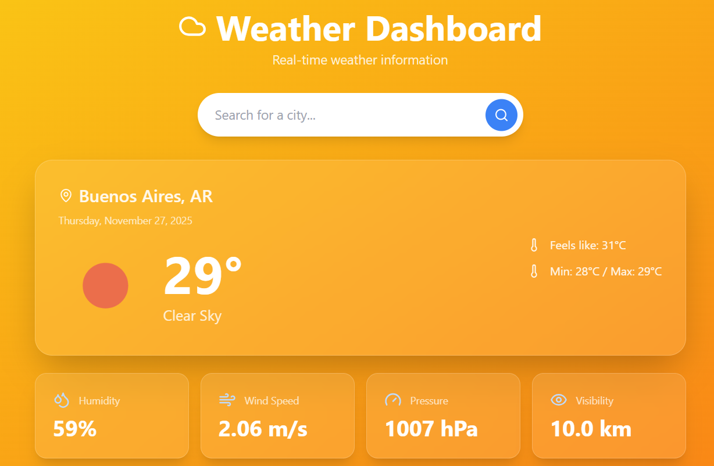
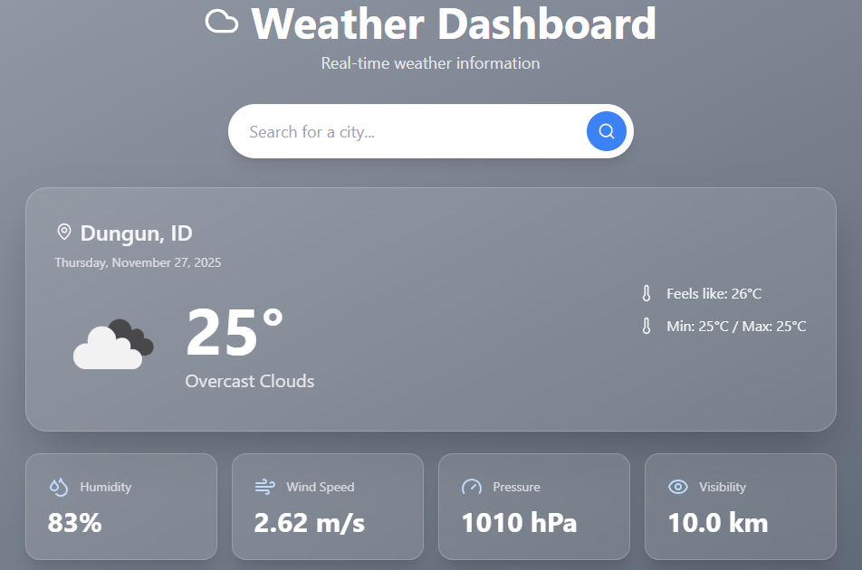
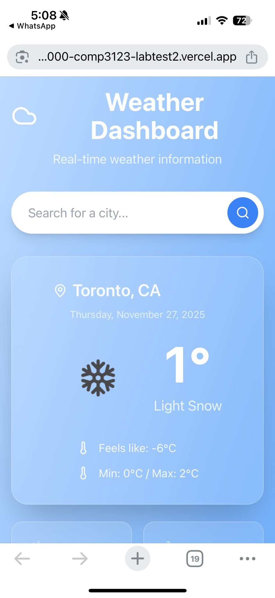
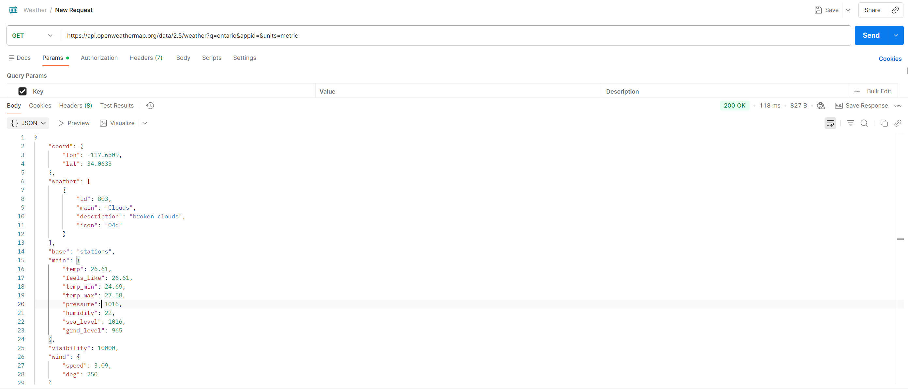

# Weather Dashboard - COMP 3123 Lab Test 2

A responsive React weather application that displays real-time weather information for cities worldwide.

## Project Description

This is a weather dashboard application built with React that fetches and displays current weather data from the OpenWeatherMap API. The application features a modern UI with dynamic backgrounds that change based on weather conditions, real-time weather updates, and a responsive design that works across all devices.

Key features include:
- Real-time weather data display
- City search functionality
- Dynamic background gradients based on weather conditions
- Comprehensive weather metrics including temperature, humidity, wind speed, pressure, and visibility
- Sunrise and sunset times
- Responsive design for mobile, tablet, and desktop

## Setup Steps

### Prerequisites
- Node.js version 14 or higher
- npm package manager
- OpenWeatherMap API key

### Installation

1. Clone the repository:
```bash
git clone https://github.com/101476000/101476000_comp3123_labtest2.git
cd 101476000_comp3123_labtest2
```

2. Install dependencies:
```bash
npm install
```

3. Configure API Key:
   - Open `src/App.js`
   - Replace the API key on line 13 with your own OpenWeatherMap API key:
   ```javascript
   const API_KEY = 'YOUR_API_KEY_HERE';
   ```

4. Add Tailwind CSS:
   - Open `public/index.html`
   - Add the following line inside the `<head>` tag:
   ```html
   <script src="https://cdn.tailwindcss.com"></script>
   ```

5. Run the application:
```bash
npm start
```

The application will open in your browser at http://localhost:3000

### Getting an API Key

1. Go to https://openweathermap.org/api
2. Sign up for a free account
3. Navigate to the API Keys section
4. Copy your API key
5. Note: New API keys may take up to 2 hours to activate

## API Used

**OpenWeatherMap API**

This project uses the OpenWeatherMap Current Weather Data API to fetch real-time weather information.

- **API Endpoint:** https://api.openweathermap.org/data/2.5/weather
- **Documentation:** https://openweathermap.org/current
- **Weather Icons:** https://openweathermap.org/weather-conditions

**API Parameters:**
- `q`: City name (e.g., Toronto, London, Paris)
- `appid`: Your API key
- `units`: metric (for Celsius temperature)

**Example API Call:**
```
https://api.openweathermap.org/data/2.5/weather?q=Toronto&appid=YOUR_API_KEY&units=metric
```

**Data Retrieved:**
- Temperature (current, feels like, min, max)
- Weather conditions and description
- Humidity percentage
- Wind speed and direction
- Atmospheric pressure
- Visibility
- Sunrise and sunset times
- Location coordinates

## Screenshots

### Main Dashboard


The main weather dashboard displaying current conditions for Toronto with temperature, weather icon, and basic information.

### Search Feature


City search functionality allowing users to search for weather in any city worldwide.

### Weather Details


Detailed weather metrics including humidity, wind speed, pressure, and visibility displayed in cards.

### Clear Weather


Dynamic yellow-orange gradient background for clear/sunny weather conditions.

### Rainy Weather


Dynamic blue gradient background for rainy weather conditions.

### Mobile View


Responsive mobile layout showing the application adapts to smaller screens.

### Postman API Response


OpenWeatherMap API response testing in Postman showing the JSON data structure.

## Notes and Assumptions

### Technical Decisions

**React Hooks:** The application uses functional components with React Hooks (useState and useEffect) for state management and side effects rather than class components.

**Styling:** Tailwind CSS is loaded via CDN for quick setup and deployment. In a production environment, installing Tailwind via npm would be preferred for better performance.

**API Integration:** The fetch API is used for making HTTP requests instead of axios to minimize dependencies.

**Error Handling:** Basic error handling is implemented. The application displays user-friendly error messages when cities are not found or API calls fail.

**Icon Library:** Lucide React is used for UI icons (search, map pin, weather indicators) to provide a consistent and modern icon set.

### Assumptions

**API Key:** The API key is stored directly in the code for simplicity in this educational project. In a production application, environment variables should be used to store sensitive information.

**Temperature Units:** The application uses metric units (Celsius) by default. This can be changed by modifying the units parameter in the API call.

**Default City:** Toronto is set as the default city that loads when the application starts.

**Browser Support:** The application assumes modern browser support with ES6+ features and fetch API availability.

**Network:** The application assumes a stable internet connection for API calls.

### Known Limitations

**API Rate Limits:** The free tier of OpenWeatherMap API has rate limits (60 calls per minute). For production use, appropriate rate limiting and caching should be implemented.

**API Key Activation:** New API keys from OpenWeatherMap can take 1-2 hours to activate. If the application shows errors immediately after setup, wait for the key to activate.

**City Name Ambiguity:** Some city names exist in multiple countries. Users can specify country codes (e.g., "Paris,FR") for more accurate results.

**Weather Icon Loading:** Weather icons are loaded from OpenWeatherMap CDN. If the CDN is slow or unavailable, icons may not display immediately.

### Future Enhancements

Potential improvements for future versions:
- 5-day weather forecast
- Geolocation support for automatic city detection
- Temperature unit toggle (Celsius/Fahrenheit)
- Recent search history
- Favorite cities list
- More detailed weather information (UV index, air quality)
- Weather alerts and warnings

## Student Information

- **Student ID:101476000
- **Name: Carlos Figuera La Riva
- **Course:** COMP 3123 - Full Stack Development I
- **Semester:** Fall 2024
- **Professor:** Pritesh Patel
- **Assignment:** Lab Test 2, Week 13

## Deployment

**Live Demo:** https://your-app.vercel.app

**GitHub Repository:** https://github.com/YOUR_USERNAME/YOUR_STUDENTID_comp3123_labtest2

---

**Last Updated:** November 27, 2024
**Last Updated:** November 27, 2024

## License

This project is created for educational purposes as part of COMP 3123 course at George Brown College.

---

**Note:** This project was completed as part of Lab Test 2 requirements. All code is original and follows academic integrity guidelines.

**Last Updated:** November 27, 2024